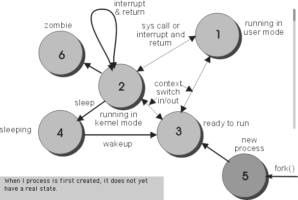

# Linux processes and services 

## Processes in Linux Systems

The ability to manage processes on your system is critical for a Linux system administrator. And to fully understand how processes work in Linux systems, we need to take a deep dive into how process are started (and even how the OS itself is started) and their life cycle.

### How a linux starts: 

The Basic Input/Output System (BIOS) is the lowest level interface between the computer and peripherals. On boot it performs integrity checks on memory and seeks instructions on the _Master Boor Record_ (MBR) on the first drive. The MBR points to the _GRand Unified Bootloader_ (GRUB). GRUB lists the Operating System (OS) labels and the user will select, or the default is selected to identify which kernel to run and which partition, on which drive it is located. GRUB then loads the GNU/Linux OS.

In a linux system the first part of the operating system that is loaded is _vmlinuz_, which is the compressed kernel executable.

> _vmlinuz_ is the name of the Linux kernel executable. vmlinuz is a compressed Linux kernel, and it is bootable. Bootable means that it is capable of loading the operating system into memory so that the computer becomes usable and application programs can be run. vmlinuz should not be confused with vmlinux, which is the kernel in a non-compressed and non-bootable form. vmlinux is generally just an intermediate step to producing vmlinuz.

This results in the creation of _init_, which is the first process of the session and which becomes the ancestor of all other processes created during that session

> For Linux distributions that use SysvInit or Upstart, the init daemon is literally named init. For systemd, the init is named systemd.

The Linux kernel has a process ID (PID) of 0. Thus, the initialization process (init or systemd) daemon has a parent process ID (PPID) of 0, and a PID of 1. Once started, init is responsible for spawning (launching) processes configured to be started at the boot time, such as the login shell.

The init daemon is not part of the Linux kernel. Therefore, it can come in different flavors, and Linux distributions can choose which flavor to use. 

> The Linux init daemon was based upon the UNIX System V init daemon. Thus, it is called the _SysVinit_ daemon. Another classic init daemon was based on Berkeley UNIX, also called BSD. Therefore, the two original Linux init daemons were BSD init and SysVinit.
The classic init daemons worked without problems for many years. However, these daemons were created to work within a static environment. As new hardware, such as USB devices, came along, the classic init daemons had trouble dealing with these and other hot-plug devices. New init daemons were needed to deal with these fluid environments.
In addition, as new services came along, the classic init daemons had to deal with starting more and more services. Thus, the entire system initialization process was less efficient and ultimately slower.

### How new processes are created:

The first step in spawning a new process is for an existing process to create an identical copy of itself. This copy is then transformed into the new process, and it, in turn, can create additional processes, thereby resulting in multiple generations of processes

There are two conventional ways used for creating a new process in Linux:
- Using The System() Function – this method is relatively simple, however, it’s inefficient and has significantly certain security risks.
- Using fork() and exec() Function – this technique is a little advanced but offers greater flexibility, speed, together with security.
	- `fork()`  creates a new process by duplicating the calling process.  The new process is referred to as the child process.
	- `exec()` family of functions replaces the current process image with a new process image.

### Process cycle:

During execution, a process changes from one state to another depending on its environment/circumstances. In Linux, a process has the following possible states:

- Running – here it’s either running (it is the current process in the system) or it’s ready to run (it’s waiting to be assigned to one of the CPUs).
- Waiting – in this state, a process is waiting for an event to occur or for a system resource. Additionally, the kernel also differentiates between two types of waiting processes; interruptible waiting processes – can be interrupted by signals and uninterruptible waiting processes – are waiting directly on hardware conditions and cannot be interrupted by any event/signal.
- Stopped – in this state, a process has been stopped, usually by receiving a signal. For instance, a process that is being debugged.
- Zombie – here, a process is dead, it has been halted but it’s still has an entry in the process table.



### Types of Processes:

There are fundamentally two types of processes in Linux:

**Foreground processes** (also referred to as interactive processes) – these are initialized and controlled through a terminal session. In other words, there has to be a user connected to the system to start such processes; they haven’t started automatically as part of the system functions/services.

**Background processes** (also referred to as non-interactive/automatic processes) – are processes not connected to a terminal; they don’t expect any user input.

#### Linux's Services and Daemons:

Linux Services and Daemons are a special class of processes that run in the background.

**Daemons:** are processes that run continuously in the background, rather than under the direct control of a user. Daemons are generally easy to recognize because their names end with the letter d.

Daemons are usually launched automatically while a computer is booting up and then wait in the background until their services are required. They typically respond to hardware activity, to network requests or to other programs by performing specified tasks. They can also configure hardware (such as the daemon devfsd, which can provide intelligent management of device entries in the device filesystem on some Linux systems), run scheduled tasks (e.g., crond) and perform a variety of other functions.

That begin said, the initialization process (init or systemd) is a daemon. Another example is the secure networking daemon, xinetd (eXtended InterNET services Daemon), which is usually launched during booting and listens passively until a program, such as FTP or telnet, requests a connection.

**Services:** A service is also a brackground process, which responds to requests from other programs over some inter-process communication mechanism (usually over a local or external network). A service is what a server provides. For example, the NFS port mapping service is provided as a separate portmap service, which is implemented as the portmapd daemon.

### Getting information about running processes:

Commands that display information about running processes get most of that information from raw data stored in the /proc file system. Each process stores its information in a subdirectory of /proc, named after the process ID of that process. You can view some of that raw data by displaying the contents of fi les in one of those directories (using cat or less commands).

#### The _top_ command:

In linux systems we can have a view of wha processes are running by executing the `top` command in the terminal.

> This command is "real-time". You can see the list is not static, it changes. That's because the `top` lists in real-time the processes that are running in your machine.
If you open a new application, you can see it begin add to the processes list.

Each entry in this list is a process. In the columns you can see information about each process. The most relevant information are:
1. The **PID** number (an unique ID for that process). The PID is used to manage the process;
2. The **USER** that's running the application;
	- This is the “effective” username (which maps to an user ID) of the user who started the process.
	- Linux assigns a real user ID and an effective user ID to processes.
	- The effective user ID allows a process to act on behalf of another user. (For example, a non-root user can elevate to root in order to install a package.)
4. _PR_ and _NI_ are values related to the process scheduling system:
	- The **PR** field shows the scheduling priority of the process from the perspective of the kernel. 
	- The **NI** field shows the “nice” value of a process. The nice value affects the priority of a process.
5. _VIRT_, _RES_, _SHR_ and _%MEM_ fields are related with memory consumption.
	- **VIRT** is the total amount of memory consumed by a process. This includes the program’s code, the data stored by the process in memory, as well as any regions of memory that have been swapped to the disk;
	- **RES** is the memory consumed by the process in RAM;
	- And **%MEM** expresses this value as a percentage of the total RAM available. Finally, “SHR” is the amount of memory shared with other processes.
6. **S** value shows the process state in the single-letter form (a process may be in various states).
	-  The status of the task which can be one of:
		- D = uninterruptible sleep
		- R = running
		- S = sleeping
		- T = stopped by job control signal
		- t = stopped by debugger during trace
		- Z = zombie

7. **TIME+** is the total CPU time used by the process since it started, precise to the hundredths of a second.
8. The **COMMAND** column shows the command name associated whit the process.

##### The _htop_:

The `htop` command is an improved `top`. It typically needs to be installed.

```
$ sudo apt-get install htop
$ htop
```
Give it a try.

#### The _ps_ and _pstree_ commands:

Theres also the `ps` command. The `ps` (i.e., process status) command is also used to provide information about the currently running processes.

> While the `top` command is mostly used interactively, `ps` is designed for non-interactive use (scripts, extracting some information with shell pipelines etc.)

While `top` allows you to display all processes statistics continuously, the `ps` gives you a **single snapshot of the running active processes** (statical).

> From the _man ps_: "By default, ps selects all processes with the same effective user ID (euid=EUID) as the current user and associated with the same terminal as the invoker.
It displays the process ID (pid=PID), the terminal associated with the process (tname=TTY), the cumulated CPU time in [DD-]hh:mm:ss format (time=TIME), and the executable name (ucmd=CMD).

That means the `ps` command without any arguments, displays processes for the current shell and same effective user ID.

You can use the `-A` or `-e` flag to select all processes. 
It's also possible to list all processes and their status and resource usage using `ps aux`.

> Basically, the `aux` means: a = show processes for all users; u = display the process's user/owner; x = also show processes not attached to a terminal

Typically, the `ps aux` and `ps -A`commands are used like this:

```
$ ps aux | grep [PROCESS YOU'RE LOOKING FOR]

or

$ ps -A | grep [PROCESS YOU'RE LOOKING FOR]
```

The processes can also be viewed with the _pstree_ command, which can be used as follows to list all of the processes currently on the system in the form of a tree diagram:

```
$ pstree
```

The addition of the `-p` option will also show the PIDs:

```
$ pstree -p
```


#### The _pgrep_ and _pidof_ command:

Using the `preg` command, you can look up processes based on name and other attributes. The _pgrep_ looks through the currently running processes and lists the process IDs which **match** the selection. Use it like this:


```
$ pgrep [option] COMMAND-PATTERN
```

There can be more than one process associated with a single _COMMAND_ field value. Therefore, the `pgrep` can return a list of PID.

Note that this command returns the **PIDs that match the given argument**. That means, that if you have _"command-one"_ and _"command-two"_ processes running and you use `$ pgrep command` it will list the pids of both processes, because both match the criteria.

The `pgrep` command also accepts a regular expression to search for running processes.

Alternatively, you can also use the command `pidof` find the process ID of a running program.
The `pidof` is much simpler than the `pgrep`, and does not accepts regex. Use `pidof` like this:

```
$ pidof chrome
```

This returns of the pid(s) for _chrome_ processes.

Different than the `pgrep`, the `pidof` returns only the **exact processes with the name _chrome_ in it**, no more, no less.

Check _man pgrep_ and _man pidof_ for more info.

### Managing processes:

#### The _kill_ command:

The name is pretty much intuitive for this one. The `kill` command sends a signal to a process using its PID.
The syntax for the command is:

```
$ kill [options] <pid> [...]
```

There are more then 30 different signals send to a process using `kill`. You can list all possible signal by running:

```
$ kill -L
```
This will list signal names in a nice table.

The signal can be specified by using its name or number. The default signal for kill is TERM.

#### The _killall_ command:

The `killall` command is very straightforward, it sends a signal to all processes running exactly any of the specified commands. It can be used like this:

```
$ killall chrome
```

In the example above, no signal name is specified, so SIGTERM is sent by default to all processes running with the command _chrome_.

> The killall command is provided by the psmisc package, and by default, it matches the argument name exactly (up to the first 15 characters) when determining the processes signals will be sent to. The `-e, --exact` option can be specified to also require exact matches for names longer than 15 characters. This makes killall somewhat safer to use compared to pkill. If the specified argument contains slash (/) characters, the argument is interpreted as a file name and processes running that particular file will be selected as signal recipients. killall also supports regular expression matching of process names, via the -r, --regexp option.

##### Some `killall` safety flags:

Here are some useful flag:

- Use the `-l, --list` to list all known signal names.
- The `-i, --interactive` can be used to interactively ask for confirmation before killing.
- You can kill only processes the specified user owns by using the `-u, --user` flag.
- And you can use the `-v, --verbose` flag to report if the signal was successfully sent.

#### The _pkill_ command:

With the `pkill` command you can signal processes based on name and other attributes. Use it like this:

```
$ pgrep [options] COMMAND-PATTERN
```

> The pgrep and pkill utilities were introduced in Sun's Solaris 7 and they take a pattern as argument which is matched against the names of running processes. While pgrep merely prints a list of matching processes, pkill will send the specified signal to the processes. The common options and semantics between pgrep and pkill comes in handy when you want to be careful and first review the list matching processes with pgrep, then proceed to kill them with pkill. Both pgrep and pkill are provided by the the procps package, which also provides other /proc file system utilities, such as ps, top, free, uptime among others.

If no signal is specified, `pkill` send SIGTERM by default.      
Use `pkill` with caution because it will **signal all the processes that match the given pattern**, its not exact like the `killall` command.

#### Changing the priority of processes with _nice / renice_ commands.

The `nice` value is a utility for managing scheduling priority of processes. Nice values range from -19 (very high priority) to 19 (very low priority) with a value of 0 being the default priority. Looking at the top output, the column marked NI indicated the current nice value of each process.

You can use the nice command to run a command with a particular `nice` value:

```
$ nice _PRIORITY_ _COMMAND_
```

The `renice` alters the scheduling priority of one or more running processes. The first argument is the priority value to be used. The other arguments are interpreted as process IDs (by default), process group IDs, user IDs, or user names. renice'ing a process group causes all processes in the process group to have their scheduling priority  altered. renice'ing a user causes all processes owned by the user to have their scheduling priority altered.

Use it like this:

```
$ sudo renice _PRIORITY_ _PID_
$ sudo renice 15 5640
```

## Linux services:

As explained before, a linux service is a special type of process that runs in the background.

You can start a service by running:

```
$ sudo service _SERVICE-NAME_ start
```
Note that once you start a process it doesn't return any message whatsoever, the service just runs in the background.
Ussaj

In a simmilar way, you can stop a service just by doing:

```
$ sudo service _SERVICE-NAME_ start
```


