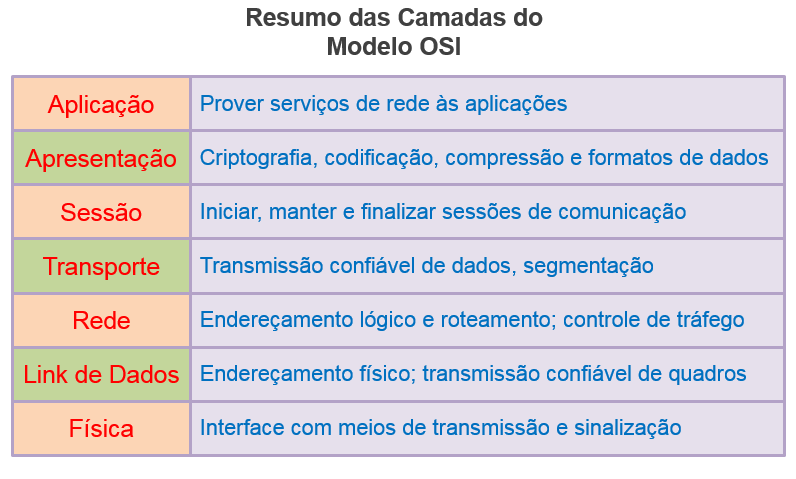
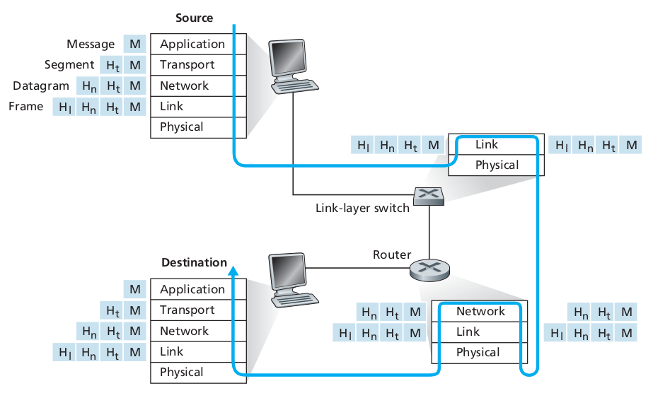

# Camadas de protocolo e seus modelos de serviço

Até o momento a _Internet_ pode parecer um sistema extremamente complexo. Exitem muitas aplicações, protocolos, vários tipos de roteadores, enlaces, sistemas finais etc, etc. Apesar dessa complexidade, podemos organizar a arquitetura da Internet em camadas para podermo estuda-la melhor.

Cada camada quando combinada com as camadas abaixo dela implementam um serviço. Um camada contribui para o sistema ao todo da seguinte maneira:
1. Realiza uma ação própria da camada
2. Usa o serviço da camada abaixo.

Estamos interessados nos **serviços** que uma camada oferece à camada acima - a isso chamamos de **modelo de serviço** de uma camada.

> Por exemplo, o serviço de uma camada _x_ pode incluir a entrega confiável de mensagens fim-a-fim através da rede. Porém isto é implementado utilizando o serviço de entrega não confiável da camada _x-1_ abaixo, a camada _x_ adiciona apenas a funcionaliadade para detectar e retransmitir os pacotes perdidos.

Uma arquitetura em camada nos permite discutir e analisar uma parte bem definida e específica de um sistema maior e mais complexo. Essa característica modular das camadas é muito valiosa pois possibilita flexibilidade de implementação para o serviço provido em cada camada. Desde que cada camada forneça o mesmo serviço para a camada superior a ela e utilize os mesmos servios da camada abaixo dela, o resto da arquitetura não precisa mudar em nada, mesmo que a implementação da camada em questão mude. Mudar a implementação de um serviço é diferente de mudar o serviço em si.

As camadas são implementadas em _software_, em _hardware_, ou em uma combnação dos dois.

IMAGEM DAS CAMADAS AQUI

Os protocolos da camada de aplicação como HTTP ou SMTP são quase sempre implementadas como softwares nos sistemas finais; assim como os protocolos da camada de transporte. Já as camadas física e de enlace, que são responsáveis pela comunicação entre roteadores - link a link -, costumam ser implementadas na placa de rede (no hadware da placa Ethernet ou Wifi) dos roteadores. Coesamente, a camada de rede, que está entre as camada de Transporte e Enlace é implementada com hardware e software.

Chamamos de _pilha de protocolos_ todos os protocolos, implementados em todas as camadas. A pilha de protocolos que implementa a Internet consiste de cinco camadas: física, enlace, rede, transporte e aplicação.

Vamos olhar cada camada, do topo -da camdada de aplicação- até o final -na camada física-. 

## 1. Camada de aplicação

Nesta camada estão as aplicação de rede - e seus protocolos. Existem diversos protocolos para camada de aplicação, como HTTP (que provê requisições e transferências para a Web), SMTP (transferência de e-mails), e FTP (transferência de arquivos entre dois sistemas finais).
Na camada de aplicação também está um protocolo muito importante e bastante conhecido, o  Sistema de Nomes de Domínio,mais conhecido pela nomenclatura em inglês _Domain Name System_ (DNS).

A camada de aplicação é distribuída em múltiplos sistemas finais, com a aplicação em um sistema final utilizando os protocolos para trocar pacotes com aplicações em outros hosts.  **_Os pacotes de informação (PDU) da camada de aplicação são nomeados de mensagens_**. 

## 2. Camada de Transporte

A camada de transporte - como o nome já diz - transporta as mensagens da camada de aplicação entre hosts fim-a-fim. Para isso, existem dois protocolos de transporte, TCP e UDP, que podem transportar as mensagens.

O transporte das mensagens pode ser implementado de duas maneiras:
- Com garantia que os dados foram entregues aos destinatários em ordem e completo - **serviço orientado a conexão**
- Sem garantia de entrega - **serviço não orientado a conexão** _também conhecidos como melhor esforço_

O **TCP é um serviço orientado a conexão**
    - Que também quebra mensagens longas em segmentos mais curtos e fornece um mecanismo de controle de congestionamento, para que uma fonte reduza sua taxa de transmissão quando a rede estiver congestionada.
E o **UDP é um serviço não orientado a conexão**

**_O pacote (PDU) da camada de rede é chamado de segmento_**.

## 3. Camada de Rede

A camada de rede é responsável por mover os **_pacotes datagramas (PDU da camada de rede)_** host-a-host, fim-a-fim.
Os protocolos da camada de transporte (TCP ou UDP) em um sistema final passam um **segmento** e um endereço de destino para a camada de rede. A camada de rede então provê o serviço de entrega do segmento para a camada de transporte do endereço de destino.

Nesta camada opera o celebrado protocolo IP, que define os campos no datagrama, assim como e todos os sistemas finais e roteadores atuam nestes campos.
Existe apenas um protocolo IP e todos os componentes da Internet que possuem uma camada de rede devem executar o protocolo IP.

A camada de de rede também possue protocolos de roteamento que determinam as rotas a serem pecorridas pelos datagramas entre os hosts de origem e destino.
Existem diversos protocolos de roteamento. Sempre lembre-se que a Internet é uma rede de redes, e em cada rede, o administrador pode exectar qualquer protocolo de roteamento que desejar.

> Embora a camada de rede contenha tanto o protocolo IP quanto vários protocolos de roteamento, ela é geralmente chamada de camada IP, refletindo o fato de que o IP é a cola que mantém a Internet junta.

## 4. Camada de Enlace

A camada de Rede roteia um datagrama por uma série de roteadores do host origem ao host destino. Para mover o pacote de um nó (entenda nó como dispositivo host ou roteador) para o próximo na rota, a camada de rede depende dos serviços da camada de enlace.

Em cada nó, a camada de rede do dispositivo passa o datagrama para a camada de enlace, que entrega o datagrama para o próximo nó na rota. Neste próximo nó, a camada de enlace do dispositivo passa o datagrama para a sua camada de rede. Os serviços providos pela camada de enlace dependem especificamente do protocolo de enlace sendo empregado nos roteadores.

A exemplo disto, alguns protocolos da camada de enlace oferecem entrega confiável de um nó para o próximo, através de um link. (Observe que esse serviço de entrega confiável é diferente do serviço de entrega confiável do TCP, que fornece entrega confiável de um sistema-final para outro.)

> Exemplos de protocolos de camada de enlace incluem Ethernet, WiFi e o protocolo DOCSIS da rede de acesso por cabo.

Como os datagramas normalmente precisam percorrer vários links para viajar da origem até o destino, um datagrama pode ser manipulado por diferentes protocolos de camada de enlace em diferentes enlaces ao longo de sua rota. Por exemplo, um datagrama pode ser manipulado pela Ethernet em um link e pelo PPP no próximo link. A camada de rede receberá um serviço diferente de cada um dos diferentes protocolos da camada de enlace.

**_Vamos nos referir aos pacotes da camada de ligação como quadros_**. Em resumo, o trabalho da camada de link é mover quadros inteiros de um elemento de rede para um elemento de rede adjacente.

## 5. Camada Física

Enquanto o trabalho da camada de link é mover quadros, o trabalho da camada física é mover os bits individuais dentro do quadro de um nó para o próximo. 

Os protocolos nesta camada novamente dependem da ligação e dependem ainda mais do meio de transmissão da ligação (por exemplo, fio de cobre de par trançado, fibra ótica de modo único).
Por exemplo, a Ethernet possui muitos protocolos de camada física: um para fio de cobre de par trançado, outro para cabo coaxial, outro para fibra e assim por diante. Em cada caso, um **bit** é movido pelo link de uma maneira diferente.

# O modelo OSI

Having discussed the Internet protocol stack in detail, we should mention that it is not the only protocol stack around. In particular, back in the late 1970s, the International Organization for Standardization (ISO) proposed that computer networks be organized around seven layers, called the Open Systems Interconnection (OSI) model [ISO 2012].
The OSI model took shape when the protocols that were to become the Internet protocols were in their infancy, and were but one of many dif-
ferent protocol suites under development; in fact, the inventors of the original OSI model probably did not have the Internet in mind when creating it. 
Nevertheless, beginning in the late 1970s, many training and university courses picked up on the ISO mandate and organized courses around the seven-layer model. Because of its early impact on networking education, the seven-layer model continues to linger on in some networking textbooks and training courses.

The seven layers of the OSI reference model, shown in Figure, are: 
1. Application layer
2. Presentation layer
3. Session layer
4. Transport layer
5. Network layer
6. Data link layer
7. Physical layer

The functionality of five of these layers is roughly the same as their similarly named Internet counterparts.
Thus, let’s consider the two additional layers present in the OSI reference model—the presentation layer and the session layer.

### The presentation layer:
Provides services that allow communicating applications to interpret the meaning of data exchanged. These services include data compression and data encryption (which are self-explanatory) as well as data description (which frees the applications from having to worry about the internal format in which data are represented/stored—formats that may differ from one computer to another).

### The session layer:
Provides for delimiting and synchronization of data exchange, including the means to build a checkpointing and recovery scheme.

The fact that the Internet lacks two layers found in the OSI reference model poses a couple of interesting questions:
Are the services provided by these layers unimportant? What if an application needs one of these services?
The Internet’s answer to both of these questions is the same—it’s up to the application developer. It’s up to the application developer to decide if a service is important, and if the service is important, it’s up to the application developer to build that functionality into the application.

# Encapsulamento

The figure below shows the physical path that data takes down a sending end system’s protocol stack, up and down the protocol stacks of an intervening link-layer switch and router, and then up the protocol stack at the receiving end system.

As we discuss later in this book, routers and link-layer switches are both packet switches. Similar to end systems, routers and link-layer switches organize their networking hardware and software into layers. But routers and link-layer switches do not implement all of the layers in the protocol stack they typically implement only the bottom layers. As shown the figure above, link-layer switches implement layers 1 and 2; routers implement layers 1 through 3. This means, for example, that Internet routers are capable of implementing the IP protocol (a layer 3 protocol), while link-layer switches are
not. We’ll see later that while link-layer switches do not recognize IP addresses, they are capable of recognizing layer 2 addresses, such as Ethernet addresses. Note that hosts implement all five layers; this is consistent with the view that the Internet architecture puts much of its complexity at the edges of the network.

The Figure also illustrates the important concept of encapsulation.
At the sending host, an application-layer message (_M_ in the Figure) is passed to the transport layer. In the simplest case, the transport layer takes the message and **appends** additional information (so-called _transport-layer header information_, _Ht_ in the Figure) that will be used by the receiver-side transport layer. The application-layer message and the transport-layer header information together constitute the transport-layer segment. The transport-layer segment thus encapsulates the application-layer message.

> The added information might include information allowing the receiver-side transport layer to deliver the message up to the appropriate application, and error-detection bits that allow the receiver to determine whether bits in the message have been changed in route.

The transport layer then passes the segment to the network layer, which adds network-layer header information (_Hn_ in the Figure) such as source and destination end system addresses, creating a network-layer **datagram**. The datagram is then passed to the link layer, which (of course!) will add its own link-layer header information and create a link-layer **frame**.

> Thus, we see that at each layer, a packet has two types of fields: header fields and a payload field. The payload is typically a packet from the layer above.

The process of encapsulation can be more complex than that described above. For example, a large message may be divided into multiple transport-layer segments (which might themselves each be divided into multiple network-layer datagrams). At the receiving end, such a segment must then be reconstructed from its constituent datagrams.
